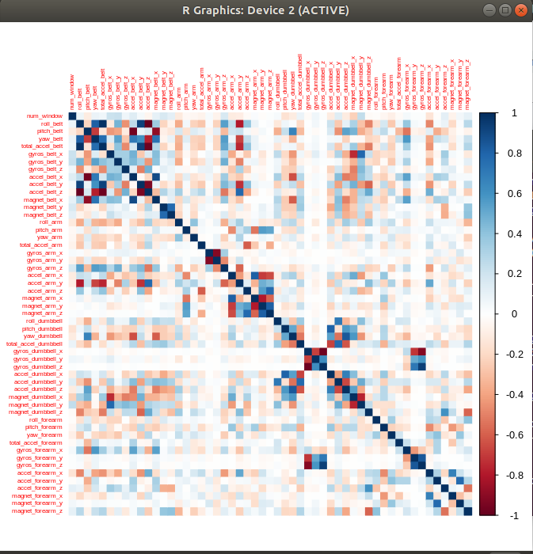
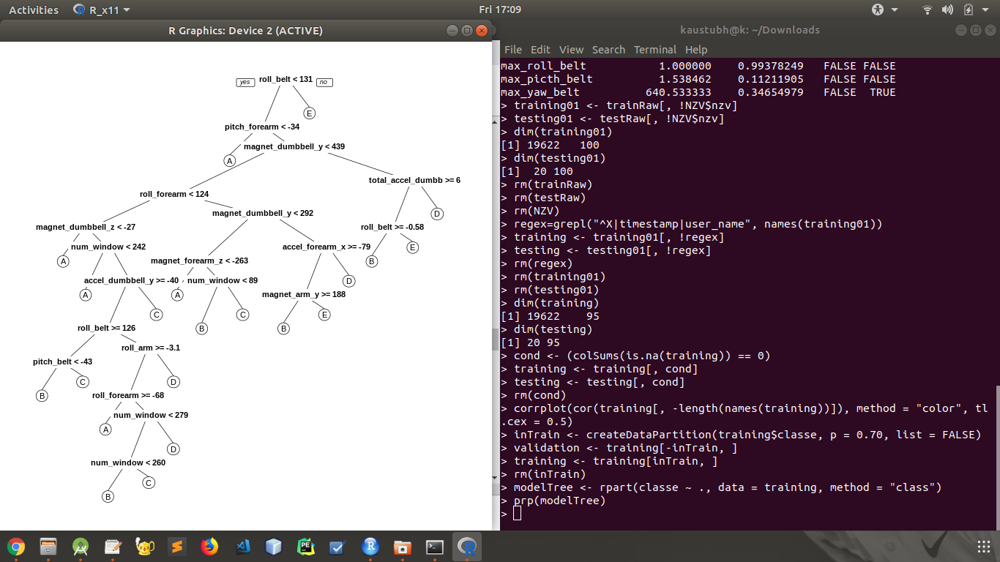

Question 

Using devices such as Jawbone Up, Nike FuelBand, and Fitbit it is now possible to collect a large amount of data about personal activity relatively inexpensively. These type of devices are part of the quantified self movement - a group of enthusiasts who take measurements about themselves regularly to improve their health, to find patterns in their behavior, or because they are tech geeks. One thing that people regularly do is quantify how much of a particular activity they do, but they rarely quantify how well they do it. In this project, our goal will be to use data from accelerometers on the belt, forearm, arm, and dumbell of 6 participants. They were asked to perform barbell lifts correctly and incorrectly in 5 different ways. More information is available from the website here: http://groupware.les.inf.puc-rio.br/har (see the section on the Weight Lifting Exercise Dataset)

library(rattle)

Rattle: A free graphical interface for data science with R.
Version 5.2.0 Copyright (c) 2006-2018 Togaware Pty Ltd.

Type 'rattle()' to shake, rattle, and roll your data.
    > library(caret)
Loading required package: lattice
Loading required package: ggplot2
    > library(rpart)
    > library(rpart.plot)
    > library(corrplot)
corrplot 0.84 loaded
    > library(randomForest)

randomForest 4.6-14

Type rfNews() to see new features/changes/bug fixes.

Attaching package: ‘randomForest’

The following object is masked from ‘package:ggplot2’: margin

The following object is masked from ‘package:rattle’: importance

    > library(RColorBrewer)
    > set.seed(56789)
    > setwd(".")
    > filetrain <- "./pml-training.csv"
    > filetest  <- "./pml-testing.csv"
    > rawtrain <- read.csv(filetrain)
    > rawtest <- read.csv(filetest)
    > dim(rawtrain)

[1] 19622   160
    
    > dim(rawtest)
[1]  20 160

    > NZV <- nearZeroVar(rawtrain, saveMetrics = TRUE)
    > head(NZV, 20)
                       freqRatio percentUnique zeroVar   nzv
    X                       1.000000  100.00000000   FALSE FALSE
    user_name               1.100679    0.03057792   FALSE FALSE
    raw_timestamp_part_1    1.000000    4.26562022   FALSE FALSE
    raw_timestamp_part_2    1.000000   85.53154622   FALSE FALSE
    cvtd_timestamp          1.000668    0.10192641   FALSE FALSE
    new_window             47.330049    0.01019264   FALSE  TRUE
    num_window              1.000000    4.37264295   FALSE FALSE
    roll_belt               1.101904    6.77810621   FALSE FALSE
    pitch_belt              1.036082    9.37722964   FALSE FALSE
    yaw_belt                1.058480    9.97349913   FALSE FALSE
    total_accel_belt        1.063160    0.14779329   FALSE FALSE
    kurtosis_roll_belt   1921.600000    2.02323922   FALSE  TRUE
    kurtosis_picth_belt   600.500000    1.61553358   FALSE  TRUE
    kurtosis_yaw_belt      47.330049    0.01019264   FALSE  TRUE
    skewness_roll_belt   2135.111111    2.01304658   FALSE  TRUE
    skewness_roll_belt.1  600.500000    1.72255631   FALSE  TRUE
    skewness_yaw_belt      47.330049    0.01019264   FALSE  TRUE
    max_roll_belt           1.000000    0.99378249   FALSE FALSE
    max_picth_belt          1.538462    0.11211905   FALSE FALSE
    max_yaw_belt          640.533333    0.34654979   FALSE  TRUE

    > training01 <- rawtrain[, !NZV$nzv]
    > testing01 <- rawtest[, !NZV$nzv]
    > dim(training01)
[1] 19622   100

    > dim(testing01)
[1]  20 100
    
    > rm(rawtrain)
    > rm(rawtest)
    > rm(NZV)
    > regex=grepl("^X|timestamp|user_name", names(training01))
    > training <- training01[, !regex]
    > testing <- testing01[, !regex]
    > rm(regex)
    > rm(training01)
    > rm(testing01)
    > dim(training)

[1] 19622    95
    > dim(testing)

[1] 20 95

    > condition <- (colSums(is.na(training)) == 0)
    > training <- training[, condition]
    > testing <- testing[, condition]
    > rm(condition)
    > corrplot(cor(training[, -length(names(training))]), method = "color", tl.cex = 0.5)

    
    > trainin <- createDataPartition(training$classe, p = 0.70, list = FALSE)
    > validation <- training[-trainin, ]
    > training <- training[trainin, ]
    > rm(trainin)
    > model <- rpart(classe ~ ., data = training, method = "class")
    > prp(model)
    
 
    
    > predictTree <- predict(model, validation, type = "class")
    > confusionMatrix(validation$classe, predictTree)
    > confusionMatrix(validation$classe, predictTree)

Confusion Matrix and Statistics

         Reference
         
         Prediction    A    B    C    D    E
         A 1526   41   20   61   26
         B  264  646   74  126   29
         C   20   56  852   72   26
         D   93   31  133  665   42
         E   82   85   93  128  694

Overall Statistics
         
         Accuracy : 0.7448          
         95% CI : (0.7334, 0.7559)
         No Information Rate : 0.3373          
         P-Value [Acc > NIR] : < 2.2e-16   
         Kappa : 0.6754          
         Mcnemar's Test P-Value : < 2.2e-16

Statistics by Class:

        Class: A Class: B Class: C Class: D Class: E

        Sensitivity            0.7688   0.7520   0.7270   0.6321   0.8494
        Specificity            0.9621   0.9019   0.9631   0.9381   0.9234
        Pos Pred Value         0.9116   0.5672   0.8304   0.6898   0.6414
        Neg Pred Value         0.8910   0.9551   0.9341   0.9214   0.9744
        Prevalence             0.3373   0.1460   0.1992   0.1788   0.1388
        Detection Rate         0.2593   0.1098   0.1448   0.1130   0.1179
        Detection Prevalence   0.2845   0.1935   0.1743   0.1638   0.1839
        Balanced Accuracy      0.8654   0.8270   0.8450   0.7851   0.8864

    > acc <- postResample(predictTree, validation$classe)
    > ose <- 1 - as.numeric(confusionMatrix(validation$classe, predictTree)$overall[1])
    > rm(predictTree)
    > rm(model)
    > modelRF <- train(classe ~ ., data = training, method = "rf", trControl = trainControl(method = "cv", 5), ntree = 250)
    > modelRF
    
    Random Forest 

    13737 samples
    53 predictor
    5 classes: 'A', 'B', 'C', 'D', 'E' 

No pre-processing

Resampling: Cross-Validated (5 fold) 

Summary of sample sizes: 10989, 10990, 10990, 10990, 10989 

Resampling results across tuning parameters:

    mtry  Accuracy   Kappa    
    2    0.9949768  0.9936459
    27    0.9976705  0.9970535
    53    0.9957051  0.9945672

Accuracy was used to select the optimal model using the largest value.

The final value used for the model was mtry = 27.

    > predictionRf <- predict(modelRF, validation)
    > confusionMatrix(validation$classe, predictionRf)

Confusion Matrix and Statistics
    
              Reference
        Prediction    A     B     C    D    E
        A           1674    0     0    0    0
        B            31    136    0    0    0
        C             0     1   1022   3    0
        D             0     0     4   960   0
        E             0     0     0    1   1081

Overall Statistics
                                          
               Accuracy : 0.998           
                 95% CI : (0.9964, 0.9989)
    No Information Rate : 0.285           
    P-Value [Acc > NIR] : < 2.2e-16       
                                          
                  Kappa : 0.9974          
    Mcnemar's Test P-Value : NA              
    
    
    Statistics by Class:

                     Class: A Class: B Class: C Class: D Class: E
    Sensitivity            0.9982   0.9991   0.9961   0.9959   1.0000
    Specificity            1.0000   0.9994   0.9992   0.9992   0.9998
    Pos Pred Value         1.0000   0.9974   0.9961   0.9959   0.9991
    Neg Pred Value         0.9993   0.9998   0.9992   0.9992   1.0000
    Prevalence             0.2850   0.1932   0.1743   0.1638   0.1837
    Detection Rate         0.2845   0.1930   0.1737   0.1631   0.1837
    Detection Prevalence   0.2845   0.1935   0.1743   0.1638   0.1839
    Balanced Accuracy      0.9991   0.9992   0.9976   0.9975   0.9999

    > acc <- postResample(predictionRf, validation$classe)
    > ose <- 1 - as.numeric(confusionMatrix(validation$classe, predictionRf)$overall[1])
    > rm(predictionRf)
    > rm(acc)
    > rm(ose)
    > predict(modelRF,testing[,-length(names(testing))])
     [1] B A B A A E D B A A B C B A E E A B B B
    
    Levels: A B C D E
    
    > to_write = function(x){
    +   n = length(x)
    +   for(i in 1:n){
    +     filename = paste0("./Assignment_Solutions/problem_id_",i,".txt")
    +     write.table(x[i], file = filename, quote = FALSE, row.names = FALSE, col.names = FALSE)
    +   }
    + }
    
    > to_write(predict(modelRF, testing[, -length(names(testing))]))
    rm(modelRF)
    > rm(training)
    > rm(testing)
    > rm(validation)
    > rm(to_write)

